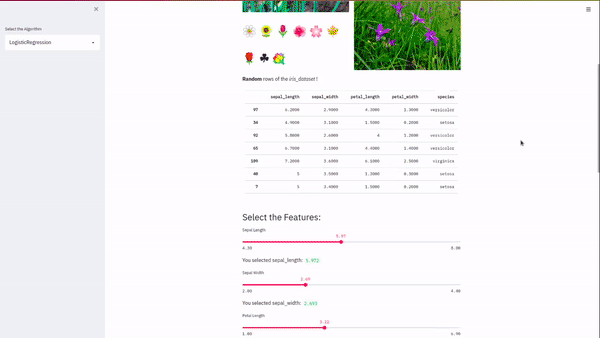

# Iris Prediction WebApp (My first fully deployed ML project :)   

## <a href='https://ml-streamlith.herokuapp.com/'>LINK IS HERE</a>

## Components :
- slide bar for selecting values of features
- 3D scatter graph for features (3 axis and 4th is the sphere size (volume)) 
- Can choose different Classification Algos  (sidebar).
-Confusion Matrix
- Created using Streamlit
- Deployed using Heroku 